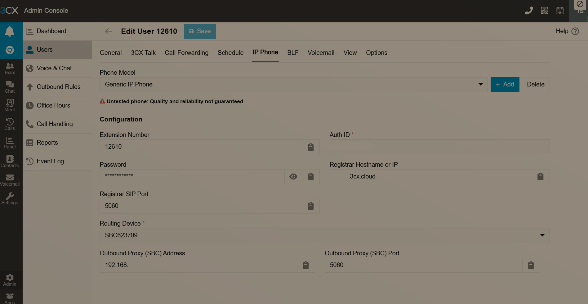

<p align="center">
  
</p>

# claude-phone × OpenClaw

A voice interface for [OpenClaw](https://github.com/openclaw/openclaw) via SIP/3CX. Give your AI a phone number — call it, and it can call you back.

Runs entirely on **ARM64** (Oracle Cloud, AWS Graviton, Raspberry Pi) or x86_64 Linux.

---

## Architecture

```
Phone (3CX app / desk phone)
        │
        ▼
3CX Cloud (YOUR_COMPANY.3cx.cloud)
        │  SIP over TLS tunnel
        ▼
3CX SmartSBC  ← Docker container, port 5060
        │  SIP INVITE
        ▼
drachtio  ← Docker, port 5070
        │
        ▼
voice-app  ← Docker, port 3000 (HTTP) / 3001 (WS audio fork)
   ├── Google Cloud TTS/STT  (primary — Wavenet voices, accurate STT)
   ├── gTTS / Google Web Speech  (free fallback — no API key)
   ├── OpenAI TTS / Whisper  (optional fallback)
   └── claude-api-server  ← Docker or host process, port 3333
              │  POST /conversation/process
              ▼
        OpenClaw AI Gateway  (YOUR_OPENCLAW_IP:18790)
              │
              ▼
        AI response → TTS → FreeSWITCH  ← Docker, port 5080 (RTP)
```

### Component ARM64 status

| Component | ARM64 | Notes |
|-----------|-------|-------|
| `drachtio-server` | ✅ native | Official multi-arch image |
| `drachtio-freeswitch-mrf` | ✅ native on Oracle Cloud | May need `platform: linux/amd64` on some ARM hosts |
| `voice-app` (Node.js) | ✅ native | `node:20-slim` is multi-arch |
| `claude-api-server` (Node.js) | ✅ native | `node:20-slim` is multi-arch |
| `3cx-sbc` (3CX SmartSBC) | ⚠️ x86_64 only | No ARM build — runs under QEMU |
| Google Cloud TTS/STT | ✅ native | REST API calls — no binary |
| gTTS / SpeechRecognition | ✅ native | Pure Python |

> **Oracle Cloud note:** The public IP is not bound to any interface — always set `EXTERNAL_IP` to
> the **private LAN IP** (e.g. `10.0.0.4`). Setting it to the public IP will break RTP.

---

## Prerequisites

| Requirement | Notes |
|-------------|-------|
| **3CX Cloud Account** | Free tier works — [3cx.com](https://www.3cx.com/) |
| **Linux server** (ARM64 or x86_64) | Docker + Docker Compose |
| **OpenClaw** running on the network | The AI backend (see [OpenClaw docs](https://docs.openclaw.ai)) |
| **Docker + Docker Compose** | All services run in containers |
| **Python 3** with pip | gTTS and SpeechRecognition (installed in Docker image) |
| **Google Cloud API key** *(recommended)* | Enables Wavenet TTS + accurate STT — [create key](https://console.cloud.google.com/) |

---

## Quick Start

### 1. Clone and configure

```bash
git clone git@github.com:shaike1/openclaw-3cx.git
cd openclaw-3cx
cp .env.example .env         # then edit — see Environment Reference below
cp voice-app/config/devices.json.example voice-app/config/devices.json   # then edit
```

### 2. Provision the 3CX SmartSBC (first time only)

```bash
./sbc/provision.sh
# Enter your SBC Auth Key from 3CX Admin → Settings → SBC
```

### 3. Start the full Docker stack

```bash
docker compose --profile full build
docker compose --profile full up -d
```

Or to start just the core voice stack (if SBC and api-server are already running as host services):

```bash
docker compose build voice-app
docker compose up -d
```

### 4. Test a call

Dial extension `12611` from any 3CX phone. You should hear the greeting.

For full setup steps see [docs/SETUP.md](docs/SETUP.md).

---

## Docker Compose Profiles

The `docker-compose.yml` has two modes:

| Profile | Services started | Use when |
|---------|-----------------|----------|
| *(none)* | `drachtio`, `freeswitch`, `voice-app` | SBC and api-server are already running as host services |
| `full` | all of the above + `3cx-sbc`, `claude-api-server` | New deployment or fully containerized setup |

```bash
# Core stack only
docker compose up -d

# Full stack (including SBC and api-server)
docker compose --profile full up -d

# Rebuild just the voice-app after code changes
docker compose build voice-app && docker compose up -d --force-recreate voice-app
```

> **Important:** After changing `.env`, always use `--force-recreate` — `docker compose restart`
> does **not** re-read `env_file` and env vars will not be updated inside the container.

---

## Device Config

`voice-app/config/devices.json` is **volume-mounted and gitignored** (contains SIP credentials).

Format — an **object keyed by extension** (not an array):

```json
{
  "12611": {
    "name": VoiceBot,
    "extension": "12611",
    "authId": "YOUR_SIP_AUTH_ID",
    "password": "YOUR_SIP_PASSWORD",
    "language": "he",
    "greeting": "שלום! איך אוכל לעזור?",
    "thinkingPhrase": "רגע אחד...",
    "prompt": "You are VoiceBot, a helpful AI assistant. Always respond in Hebrew. Keep responses under 40 words.",
    "voiceId": "YOUR_ELEVENLABS_VOICE_ID"
  }
}
```

| Field | Description |
|-------|-------------|
| `extension` | 3CX extension number |
| `authId` | SIP Auth ID from 3CX **IP Phone** tab (not the extension number) |
| `password` | SIP password from 3CX IP Phone tab |
| `language` | BCP-47 language code (`he`, `en`, `ar`, `ru`, `fr`, `es`) |
| `greeting` | Spoken when a call connects |
| `thinkingPhrase` | Spoken while waiting for AI response |
| `prompt` | System prompt sent to OpenClaw on every turn |
| `voiceId` | ElevenLabs voice ID (only used if ElevenLabs is the TTS fallback) |



> The **Auth ID** is not the extension number — it's a separate credential on the IP Phone tab.

---

## Environment Reference

```env
# ── Network ────────────────────────────────────────────────────────────────
# MUST be the server's LAN IP — not the public IP.
# On cloud NAT (Oracle, AWS) the public IP is not on any interface.
EXTERNAL_IP=YOUR_SERVER_LAN_IP

# ── Drachtio ───────────────────────────────────────────────────────────────
DRACHTIO_HOST=127.0.0.1
DRACHTIO_PORT=9022
DRACHTIO_SECRET=your_drachtio_secret
DRACHTIO_SIP_PORT=5070          # drachtio listens here; 5060 is used by 3CX SBC

# ── FreeSWITCH ─────────────────────────────────────────────────────────────
FREESWITCH_HOST=127.0.0.1
FREESWITCH_PORT=8021
FREESWITCH_SECRET=JambonzR0ck$

# ── 3CX SIP ────────────────────────────────────────────────────────────────
SIP_DOMAIN=YOUR_COMPANY.3cx.cloud
SIP_REGISTRAR=127.0.0.1         # SmartSBC on same host proxies REGISTER to 3CX

# ── OpenClaw bridge ────────────────────────────────────────────────────────
CLAUDE_API_URL=http://127.0.0.1:3333

# Used by claude-api-server container (--profile full):
OPENCLAW_HOST=YOUR_OPENCLAW_IP
OPENCLAW_PORT=18790

# ── TTS / STT ──────────────────────────────────────────────────────────────
# Google Cloud: high-quality Wavenet voices + accurate STT (recommended)
# Create at console.cloud.google.com → APIs & Services → Credentials → API Key
# Enable: Cloud Text-to-Speech API + Cloud Speech-to-Text API
GOOGLE_CLOUD_KEY=

# MOSS TTS: GPU-accelerated voice cloning via Gradio (x86 only — too slow on ARM)
# Leave empty on ARM deployments; gTTS (~500 ms) is used instead
MOSS_TTS_URL=

# Optional higher-quality fallbacks
ELEVENLABS_API_KEY=
OPENAI_API_KEY=

# ── App ports ──────────────────────────────────────────────────────────────
HTTP_PORT=3000
WS_PORT=3001
AUDIO_DIR=/app/audio
```

---

## TTS / STT Stack

The voice-app tries providers in order, falling back on error:

### Text-to-Speech

| Priority | Provider | Key required | Quality | Latency |
|----------|----------|-------------|---------|---------|
| 1 | **Google Cloud TTS** (Wavenet) | `GOOGLE_CLOUD_KEY` | Excellent | ~300 ms |
| 2 | MOSS TTS (GPU voice cloning) | `MOSS_TTS_URL` | Excellent | >15 s on ARM |
| 3 | **gTTS** (Google Translate TTS) | none | Good | ~500 ms |
| 4 | OpenAI TTS | `OPENAI_API_KEY` | Excellent | ~1 s |
| 5 | ElevenLabs | `ELEVENLABS_API_KEY` | Excellent | ~1 s |

### Speech-to-Text

| Priority | Provider | Key required | Quality |
|----------|----------|-------------|---------|
| 1 | **Google Cloud STT** | `GOOGLE_CLOUD_KEY` | Excellent, multilingual |
| 2 | **Google Web Speech** (free) | none (needs `flac` binary) | Good |
| 3 | OpenAI Whisper | `OPENAI_API_KEY` | Excellent |

> **Hebrew notes:** gTTS uses `iw` lang code; Google Web Speech uses `iw-IL` locale.
> Both are mapped automatically from `"language": "he"` in devices.json.

---

## Outbound Calling API

The voice-app exposes a REST API on port 3000:

```bash
# Announce mode — play a message then hang up
curl -X POST http://SERVER_IP:3000/api/outbound-call \
  -H 'Content-Type: application/json' \
  --data-binary '{
    "to": "+15551234567",
    "device": "12611",
    "mode": "announce",
    "message": "Hello, this is an automated message."
  }'

# Conversation mode — stay on the line for two-way AI conversation
curl -X POST http://SERVER_IP:3000/api/outbound-call \
  -H 'Content-Type: application/json' \
  --data-binary '{
    "to": "12610",
    "device": "12611",
    "mode": "conversation",
    "message": "שלום! במה אוכל לעזור?"
  }'
```

| Field | Description |
|-------|-------------|
| `to` | Phone number (E.164 `+15551234567`) or internal extension (`12610`) |
| `message` | Opening line spoken when the call connects |
| `device` | Extension or name of the calling device |
| `mode` | `announce` (play + hangup) or `conversation` (two-way AI) |
| `context` | Background info for the AI — not spoken aloud |
| `timeoutSeconds` | Ring timeout in seconds (default: 30) |

---

## OpenClaw Phone-Call Plugin

The `openclaw-phone-call/` directory contains an OpenClaw plugin that lets the AI proactively
make phone calls as a tool action — e.g. "call extension 12610 and tell them dinner is ready".

### Plugin files

```
openclaw-phone-call/
├── index.ts                 # Plugin registration
├── package.json
├── openclaw.plugin.json     # Plugin manifest + config schema
└── src/
    └── phone-call-tool.ts   # Tool implementation (calls /api/outbound-call)
```

### Installation

Copy the plugin into your OpenClaw extensions folder and install its dependencies:

```bash
mkdir -p ~/.openclaw/extensions
cp -R openclaw-phone-call ~/.openclaw/extensions/phone-call
cd ~/.openclaw/extensions/phone-call
npm install
```

Restart the OpenClaw Gateway.

### Plugin configuration

In OpenClaw, configure the `phone-call` plugin (under extension settings):

```json
{
  "voiceServerUrl": "http://YOUR_SERVER_LAN_IP:3000",
  "defaultDevice": "12611",
  "defaultMode": "conversation",
  "timeoutSeconds": 30
}
```

| Field | Description |
|-------|-------------|
| `voiceServerUrl` | Base URL of the voice-app HTTP API |
| `defaultDevice` | Extension to use when the tool doesn't specify one |
| `defaultMode` | `announce` or `conversation` |
| `timeoutSeconds` | Ring timeout (default: 30) |

### Tool: `phone-call`

Once installed, the AI can call this tool to place calls:

| Parameter | Type | Required | Description |
|-----------|------|----------|-------------|
| `to` | string | yes | Phone number (E.164) or internal extension |
| `message` | string | yes | What the device says when the call connects |
| `mode` | `announce`\|`conversation` | no | Defaults to plugin `defaultMode` |
| `device` | string | no | Override calling device (extension or name) |
| `context` | string | no | Background info for the AI — not spoken aloud |
| `timeoutSeconds` | number | no | Ring timeout (5–120) |

**Example AI interaction:**

> User: "Call extension 12610 and remind them to take their medication"
>
> AI uses `phone-call` tool → `{ "to": "12610", "message": "הגיע הזמן לקחת תרופות", "mode": "announce" }`

---

## claude-api-server (OpenClaw Bridge)

A lightweight Node.js server that translates voice-app requests into OpenClaw API calls.

```
voice-app  →  POST http://127.0.0.1:3333/ask  →  claude-api-server
                                                         │
                                                         ▼
                                               POST http://OPENCLAW_IP:18790/conversation/process
                                                         │
                                                         ▼
                                               { response: { speech: { plain: { speech: "..." } } } }
```

Run as a Docker container (recommended with `--profile full`) or as a host process:

```bash
# Docker (included in --profile full)
docker compose --profile full up -d claude-api-server

# Host process
cd claude-api-server && npm install
OPENCLAW_HOST=YOUR_OPENCLAW_IP OPENCLAW_PORT=18790 node server.js

# Health check
curl http://localhost:3333/health
```

---

## Port Reference

| Port | Service | Note |
|------|---------|------|
| 5060 | 3CX SmartSBC | Docker (`--profile full`) or host service |
| 5070 | drachtio | Docker, host network |
| 5080 | FreeSWITCH SIP | Docker, host network |
| 5090 | SBC → 3CX tunnel | Outbound TCP only |
| 8021 | FreeSWITCH ESL | Internal |
| 9022 | drachtio admin | Internal |
| 3000 | voice-app HTTP API | Outbound call API + audio file serving |
| 3001 | voice-app WebSocket | Per-call audio fork from FreeSWITCH |
| 3333 | claude-api-server | OpenClaw bridge |
| 20000–20063 | 3CX SBC RTP relay | Used by SBC — do not overlap |
| 30000–30100 | FreeSWITCH RTP | Kept clear of SBC range |

---

## Troubleshooting

| Problem | Solution |
|---------|----------|
| No INVITE at drachtio | `EXTERNAL_IP` must be LAN IP; check SBC tunnel: `ss -tnp \| grep 5090` |
| 403 on REGISTER | Auth ID ≠ extension — get it from 3CX IP Phone tab |
| Bot speaks but can't hear you | STT failing — check logs for `FLAC` or API key errors |
| Env vars not updated in container | `docker compose restart` is not enough — use `--force-recreate` |
| `expectSession TIMEOUT` | TTS too slow — disable MOSS TTS on ARM (`MOSS_TTS_URL=`) |
| AI returns "unexpected error" | Check api-server: `curl http://localhost:3333/health` |

```bash
# Live logs
docker logs voice-app -f
docker logs drachtio -f

# Check SIP registration
docker logs voice-app | grep REGISTRAR

# Verify Google Cloud key is visible inside container
docker exec voice-app printenv GOOGLE_CLOUD_KEY

# Test TTS manually
docker exec voice-app python3 -c "from gtts import gTTS; gTTS('שלום', lang='iw').save('/tmp/t.mp3')" && echo "OK"
```

See [docs/TROUBLESHOOTING.md](docs/TROUBLESHOOTING.md) for detailed troubleshooting.

---

## Full Setup Guide

See [docs/SETUP.md](docs/SETUP.md) for the complete step-by-step guide including 3CX SBC setup,
Google Cloud API key creation, ARM64 deployment, and the full OpenClaw plugin setup.

---

## License

MIT
